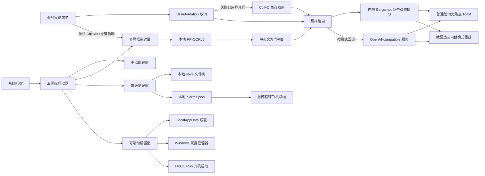

# Huaci 极简划词翻译

Huaci 是面向 Windows 10/11 的轻量桌面翻译工具。程序常驻系统托盘，可对鼠标划选文本、手动输入内容和屏幕框选区域进行翻译，并优先在本机离线完成英中互译。

当前版本为 `1.3.2` 个人内测版，重点是极简交互、离线隐私、快速笔记、本地闹铃和 ZIP 解压即用。

完整版本亮点、修复记录和一些有趣的实现细节见 [CHANGELOG.md](CHANGELOG.md)。

## 当前能力

- 256×162 半透明极简启动器，只保留“划词、翻译、截图、笔记、设置”五个图标；每行最多 4 个并自动向下排列
- 程序启动后默认显示并永久置顶主窗口；只有用户点击最小化、X 或按 `Ctrl+F1` 才会隐藏
- 鼠标拖选或双击外语文本后自动取词，在选区附近显示简体中文 Toast
- 优先通过 Windows UI Automation `TextPattern` 读取选区；可选 `Ctrl+C` 兼容模式默认关闭
- Toast 无外层白框，鼠标移开立即消失，可点击钉子固定，长译文可滚动
- 手动翻译支持“英语 ⇄ 简体中文”方向切换，已有原文和译文会随方向交换
- 内置 Mozilla Firefox Translations `en→zh` 与 `zh→en` 模型及 Bergamot WASM 引擎
- 内置 RapidOcrNet 与 PP-OCRv5 mobile 中英文 OCR，可对屏幕区域进行离线文字识别
- 截图翻译默认手势为按住 `Ctrl + Alt + 鼠标左键` 直接拖动，松开即完成框选；从启动器点击“截图”不会主动隐藏、缩小或移动主窗口
- 截图后高对比度选框持续保留；识别完成后按原区域明暗重建不透明阅读画布，中文直接替换式排回选区，并可在“原文/译文”之间切换
- OCR 行坐标用于还原段落间距、页边距与字号；复制、切换和关闭集中在右下角极简工具条，结果只能手动关闭
- 快速笔记可通过按钮、`Ctrl+V` 或拖放保存剪贴板文字与图片，并浏览、复制、删除本地历史记录
- 快速笔记与闹铃共用同一历史列表；闹铃条目显示标识，点击可查看准确时间和取消提醒
- 到点后分层矢量飞机会伴随轻量飞越音效牵引横幅，在屏幕顶部持续循环飞行；长文自动省略，直到手动关闭
- 可选随 Windows 开机启动，默认关闭且无需管理员权限；启动后同样先显示主窗口
- 默认“离线优先”，也可选择“仅离线”或“仅在线”
- OpenAI-compatible 在线翻译为可选能力，默认预填 DeepSeek 接口
- API Key 仅写入 Windows Credential Manager，不进入 `settings.json`
- 主窗口的最小化与 X 都隐藏到托盘，不会退出后台服务
- EXE、快捷方式与系统托盘统一使用“译”字图标；自包含 `win-x64` 发布无需预装 .NET

## 使用方式

### 自动划词

1. 解压 ZIP，运行 `Huaci.exe`；主窗口会立即显示，同时默认开启自动划词。
2. 在浏览器、文档等应用中拖选英文或双击单词。
3. 松开鼠标后，译文会显示在选区附近；移开 Toast 即关闭，点击钉子可保留。

自动划词当前面向“外语→简体中文”。某些自绘应用无法提供 UI Automation 文本时，可在设置中开启 `Ctrl+C` 兼容模式。
自动划词的开关只由启动器首页“划词”图标控制；设置页只保留兼容模式配置。点击图标可暂停本次运行，下次启动会自动恢复开启。
主窗口隐藏到托盘后，可按全局 `Ctrl+F1` 再次召唤；窗口显示时按相同快捷键会将其隐藏。

### 手动中英互译

1. 点击启动器的“翻译”。
2. 点击窗口顶部的 `⇄` 在“英语→简体中文”和“简体中文→英语”之间切换。
3. 输入文字后点击“翻译”。切换方向时，如已有译文，窗口会自动交换两侧内容。

### 截图翻译

1. 按住 `Ctrl + Alt + 鼠标左键`，直接拖出需要翻译的矩形区域。
2. 松开鼠标左键即完成框选，随后执行本地 OCR 和翻译；不需要松开后再拖一次。若只是点击或选区太小，遮罩会继续保留，等待重新框选。
3. 选框会持续留在原区域；识别完成后，Huaci 会覆盖原图文字并把中文按原区域的页边距、字号和段落结构重新排入框内，不会再出现单独的跟随窗口。
4. 右下角可切换“原文/译文”、复制译文或点击 `X` 关闭。结果不会因鼠标移开或超时消失。
5. 框选阶段可按 `Esc` 或单击右键取消；结果阶段也可通过右键手动关闭。

也可以点击启动器的“截图”图标进入框选模式。此操作不会主动隐藏、缩小、移动主窗口或改变其窗口状态；只有用户点击最小化、关闭或按 `Ctrl+F1` 时才会隐藏。全局手势可在设置中关闭；关闭后 `Ctrl + Alt + 左键` 会原样交给当前应用。

### 快速笔记

1. 点击启动器或托盘菜单中的“快速笔记”。
2. 直接输入文字后保存，或点击“粘贴保存”自动识别剪贴板中的文字/图片。
3. 复制图片后可直接按 `Ctrl+V` 保存；也支持从资源管理器复制或拖入常见图片文件。
4. 在历史列表中选择内容即可复制或删除；双击文字会载入编辑框，双击图片会复制图片。

文字以 UTF-8 `.txt` 保存，图片以 `.png` 保存。默认目录为程序旁的 `save` 文件夹；若程序所在目录不可写，会自动回退到 `%LocalAppData%\Huaci\save`。所有笔记只保存在本机，不参与翻译或上传。

### 笔记闹铃

1. 在快速笔记编辑框输入提醒文字，或选择一条已有文字笔记。
2. 点击“新建笔记”标题旁的“设置闹铃”，在小窗口中编辑横幅文案并选择日期、小时和分钟；也可快速选择 10 分钟、30 分钟或 1 小时后。
3. 闹铃保存在本地 `save\alarms.json`，并与普通笔记一起显示在历史列表中；闹铃条目右侧带有标识，点击即可查看准确时间或取消提醒。
4. 成功设置后编辑框会立即清空。到点时，带机翼起伏、机身俯仰、引擎与航行灯动效的矢量飞机会播放一次轻量飞越音效，并牵引文字横幅在虚拟屏幕顶部循环飞过。长文字自动显示省略号，鼠标悬停可暂停并查看全文。
5. 点击横幅上的 `X` 才会确认完成；多个同时到点的闹铃会按时间顺序逐个出现。程序重启后，尚未确认的过期闹铃仍会继续提醒。

## 离线、联网与隐私

截图像素只在内存中交给本地 OCR，不会由 Huaci 写入临时图片或上传。是否联网只影响 OCR 后的文字以及普通待译文本：

| 翻译模式 | 截图像素 | 识别/待译文字 |
|---|---|---|
| 仅离线 | 始终留在本机内存 | 始终由内置模型处理 |
| 离线优先 | 始终留在本机内存 | 优先本地；本地失败时可发送给已配置的在线服务 |
| 仅在线 | 始终留在本机内存 | 会发送给用户配置的 OpenAI-compatible 服务 |

内置翻译引擎和双向模型约 105 MiB，OCR 模型约 21 MiB；这些资源还不包含自带的 .NET 运行时和其他依赖。当前 `1.3.2` 自包含 ZIP 约 173 MiB，解压后约 333 MiB；首次打开快速笔记时会自动建立 `save` 文件夹。

## 架构



项目主要使用 .NET 10、WPF、Win32、UI Automation、Windows Credential Manager、Microsoft WebView2、Bergamot WASM 和 RapidOcrNet。第三方说明、模型哈希及许可证分别位于发布目录的 `Offline` 与 `Ocr` 文件夹。

## 开发与构建

要求 Windows x64 与 .NET 10 SDK：

```powershell
dotnet restore .\src\Huaci.App\Huaci.App.csproj
dotnet build .\Huaci.slnx -c Release
```

运行逻辑烟测和真实 WPF/离线模型验证：

```powershell
dotnet run --project .\tests\Huaci.SmokeTests\Huaci.SmokeTests.csproj -c Release
dotnet run --project .\tests\Huaci.UiTests\Huaci.UiTests.csproj -c Release -- .\artifacts\ui-tests
```

UI 测试会真实加载英中和中英两个离线模型及 PP-OCRv5，验证四列自动换行与永久置顶启动器、笔记闹铃成功后清空输入、笔记与闹铃统一历史、真实到点调度、飞机与横幅相对位置、矢量飞机动效、每个闹铃只播放一次声音、截图入口不改变启动器状态、截图选区内替换式重排与原文切换、手动方向切换，以及普通划词 Toast 的透明、固定、滚动和鼠标移开行为。测试不会启动系统托盘或全局鼠标钩子，也不会请求在线翻译 API。

生成便携版：

```powershell
.\scripts\package-portable.ps1
```

默认产物为 `artifacts/Huaci-1.3.2-win-x64-portable.zip`。便携版自带 .NET、翻译模型和 OCR 模型，解压后直接运行 `Huaci.exe`。程序仍复用系统 Microsoft Edge WebView2 Runtime：Windows 11 通常自带，绝大多数已更新的 Windows 10 也已安装；缺少时 Huaci 会提示安装。

## 已知边界

- 普通权限运行时，受 Windows UIPI 限制，Huaci 无法读取或截取管理员权限窗口。
- 密码框和 Huaci 自己的窗口会被自动划词跳过。
- 自动划词会跳过纯中文内容；中文→英文请使用手动翻译或截图翻译。
- 内置离线翻译目前只支持英语与简体中文；其他语言需要在线服务。
- OCR 结果会受字体大小、缩放、背景纹理、压缩噪声和遮挡影响，低清图片可能无法识别。
- “替换式翻译”是位于原选区上方的本地重建阅读层，不会修改网页或文档本身；复杂图片、渐变和纹理背景会优先还原为同明暗的纯色画布，以保证译文清晰可读。
- 启用截图手势后，按住 `Ctrl + Alt + 左键` 的拖动会被 Huaci 用于直接框选；与其他软件冲突时可在设置中关闭，并改用启动器入口。
- 首次加载某个方向的离线模型需要数秒，后续短文本通常更快。
- `Ctrl+F1` 是系统级快捷键；如果启动瞬间被其他软件占用，Huaci 会提示并每 4 秒自动重试，恢复后给出通知。长期冲突时仍可通过托盘图标打开主窗口。
- WebView2 Evergreen Runtime 的系统更新行为不属于 Huaci 的翻译网络请求。
