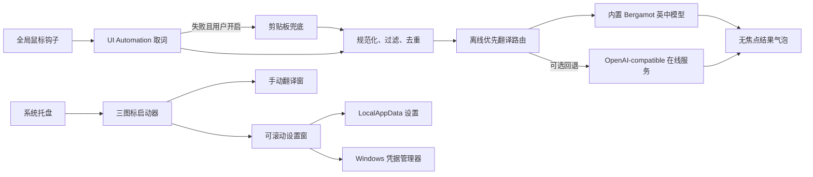

# 划词翻译（Huaci）

一个面向 Windows 10/11 的轻量桌面划词翻译工具。程序常驻系统托盘，鼠标划选外语文字后自动读取选区，并在选区附近显示简体中文译文。

当前是个人内测 MVP：优先保证取词链路、离线隐私边界和便携部署。OCR 与历史记录暂未加入。

## 当前能力

- 启动后先显示极简主启动器；系统托盘常驻，双击托盘图标可再次显示或隐藏
- 鼠标拖选或双击单词后自动触发
- 优先通过 Windows UI Automation `TextPattern` 读取选区
- 可选 `Ctrl+C` 剪贴板兜底，默认关闭，并尽力恢复原剪贴板
- 无外框的半透明灰黑 Toast；鼠标移开立即消失，也可点击钉子固定；超长译文可在窗口内滚动
- 内置 Mozilla Firefox Translations 英语→简体中文模型与 Bergamot WASM 引擎，可真正断网翻译
- 默认“离线优先”；也可切换为“仅离线”或“仅在线”，本地失败时才按设置回退在线
- OpenAI-compatible 在线翻译为可选能力，默认配置为 DeepSeek
- API Key 仅写入 Windows Credential Manager，不进入 `settings.json`
- 可拖动、可记忆位置的 292×156 极简启动器，只保留划词、翻译和设置三个图标入口
- 独立的可滚动设置小窗，集中管理自动划词、兼容取词、响应时间、Toast 时长、翻译模式和在线服务
- 独立手动翻译小窗，主启动器始终保持简洁
- 主启动器提供最小化与 X 按钮，两者都会隐藏到托盘而不退出程序
- 自包含 `win-x64` 发布，可解压即用

## 使用

1. 解压 ZIP 后运行 `Huaci.exe`，程序先显示极简主启动器并驻留系统托盘。
2. 直接在浏览器、文档等应用中拖选英文；内置模型会在本机生成简体中文译文，不需要 API Key。
3. 译文显示在松开鼠标的位置附近；移开鼠标会消失，点击钉子后保持显示。
4. 如需翻译其他语言，可在“设置”中配置 OpenAI-compatible API，并选择“离线优先”或“仅在线”。默认 API 地址是 `https://api.deepseek.com`，模型是 `deepseek-chat`。
5. 双击托盘图标可再次显示或隐藏主窗口；右键托盘图标可暂停自动划词或退出。

兼容接口既可以填写服务的基础地址，也可以直接填写以 `/chat/completions` 结尾的完整地址。

## 架构



项目主要使用 .NET 10、WPF、Win32、UI Automation、Windows Credential Manager 和 Microsoft WebView2。离线引擎及模型资源随程序发布；第三方说明、精确模型哈希与 MPL-2.0 全文位于发布目录的 `Offline` 文件夹。

## 开发与构建

要求 Windows x64 与 .NET 10 SDK：

```powershell
dotnet restore .\src\Huaci.App\Huaci.App.csproj
dotnet build .\src\Huaci.App\Huaci.App.csproj -c Debug
```

运行逻辑烟测与真实 WPF Toast 渲染验证：

```powershell
dotnet run --project .\tests\Huaci.SmokeTests\Huaci.SmokeTests.csproj -c Debug
dotnet run --project .\tests\Huaci.UiTests\Huaci.UiTests.csproj -c Debug -- .\artifacts\ui-tests
```

UI 验证不会启动托盘、全局鼠标钩子或请求翻译 API；它会实际加载随包内置的英中模型，断言得到中文译文，同时检查 Toast 的透明、无焦点、固定和滚动状态，以及三图标启动器、可滚动设置窗、独立手动翻译窗、标题栏拖动命中、位置恢复与设置草稿保留。

生成便携版：

```powershell
.\scripts\package-portable.ps1
```

产物位于 `artifacts`。便携版自带 .NET 运行时、Bergamot 引擎和英中模型，不要求目标电脑预装 .NET；解压后运行 `Huaci.exe` 即可。为控制体积，程序复用系统的 Microsoft Edge WebView2 Runtime：Windows 11 自带，绝大多数已更新的 Windows 10 也已安装；缺少时程序会给出明确提示。用户设置与密钥仍保存在当前 Windows 用户的本地配置和凭据管理器中，而不是程序目录。

## 已知边界

- 出于 Windows UIPI 安全限制，普通权限运行的 Huaci 不读取管理员权限窗口中的选区。
- 密码框和 Huaci 自己的窗口会被跳过。
- 部分自绘界面、游戏、远程桌面和未暴露 UIA 文本接口的应用需要剪贴板兜底；图片文字需要后续 OCR 版本。
- 当前“纯中文跳过”启发式无法可靠区分只包含汉字的日文短语。
- 内置离线 v1 只支持英语→简体中文；其他语言需要配置在线服务。
- 首次加载内置模型需要数秒，程序启动后会在后台预热；之后短文本翻译通常更快。
- 翻译计算和待译文本完全在本机；WebView2 Evergreen Runtime 自身的系统更新行为不属于翻译请求。
